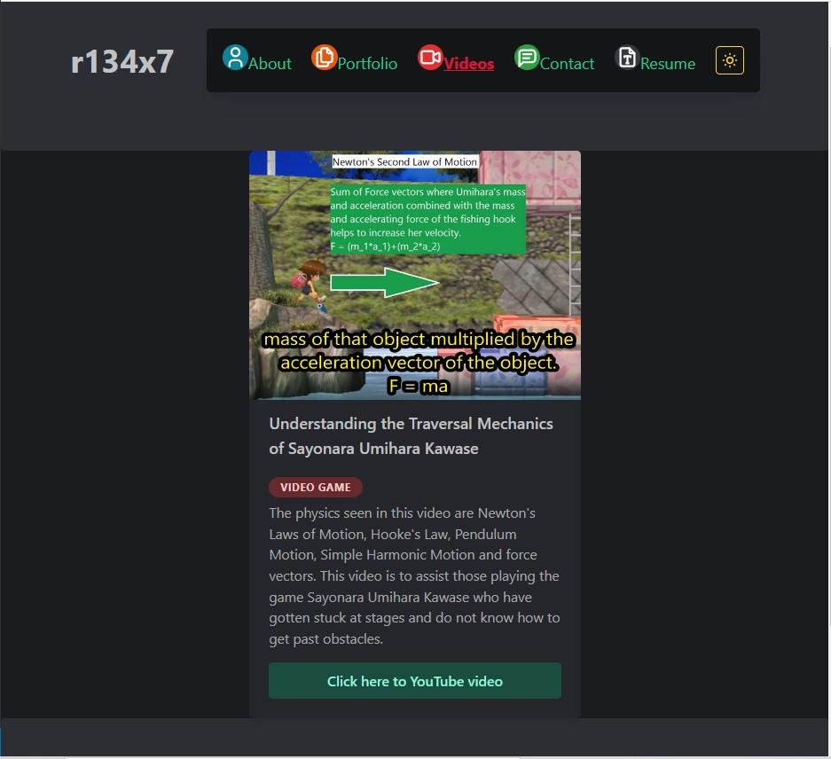

# My Portfolio ver 2.0

  

  # Description
  
  A new version of my portfolio webpage made using React and Mantine (React component library). Contact page demonstrates a form with multiple validation instances but cannot actually send messages. Mantine features used: Form, theming (with switching between light and dark mode, click on the moon/sun icon). Icons used for navigation from Tabler Icons React.

  # Table of Contents
  
  - [Installation](#installation)
  - [Usage](#usage)
  - [Deployed App](#deployed-app)
  - [Tests](#tests)
  - [Questions](#questions)

  # Installation
  
  Node.js, NPM packages: React, Mantine: @mantine/hooks, @mantine/form, @mantine/core. gh-pages and tabler-icons-react.

  # Usage
  
  
  

  # Deployed App
  
  Link to deployed application: [https://r134x7.github.io/my-portfolio-ver_2.0/](https://r134x7.github.io/my-portfolio-ver_2.0/)

  # Tests
  
  None written.

  # Questions
  
  You can find my GitHub profile at: https://github.com/r134x7

  If you have any questions, you can contact me by email: r134x7@gmx.com

